# Draf Kompilasi Laporan Akhir Proyek NutriGrow
## Berdasarkan Rubrik Penilaian Laporan Akhir Proyek (Struktur Skripsi)
### Untuk Digenerasikan Menjadi PDF Menggunakan AI

---

# LAPORAN AKHIR PROYEK

## **SISTEM MONITORING DAN OTOMASI IRIGASI CERDAS PADA PERTANIAN BERBASIS IOT MENGGUNAKAN FUZZY LOGIC DENGAN WEB DASHBOARD**

**Disusun oleh:**
1. Maulana Daviq Putra (2307422024)
2. Muhammad Ali Diepo Ar-Rasyid (2307422023)
3. Muhammad Athaillah Hardianto (2307422011)
4. Muhammad Pandya Hanif Ramadhan (2307422006)
5. Ravila Sasla Arandika (2307422026)

**PROGRAM STUDI TEKNIK MULTIMEDIA DAN JARINGAN**
**JURUSAN TEKNIK INFORMATIKA DAN KOMPUTER**
**POLITEKNIK NEGERI JAKARTA**
**2026**

---

## **BAB I – PENDAHULUAN**

### **1.1 Latar Belakang**
Praktik fertigasi (pemberian air dan nutrisi tanaman) konvensional pada perkebunan sering kali menghadapi tantangan efisiensi sumber daya dan kendala infrastruktur. Penyiraman terjadwal secara manual bersifat tidak responsif terhadap fluktuasi cuaca lokal, menyebabkan pemborosan air dan pupuk saat hujan turun. Selain itu, keterbatasan jaringan seluler (Wi-Fi/4G) di area perkebunan rural sering kali menimbulkan *blank spot* komunikasi data IoT, yang membatasi penerapan pemantauan jarak jauh.

Untuk menjawab masalah tersebut, dikembangkan sistem **NutriGrow (Bitanic Pro V4)**. Sistem ini mengintegrasikan mikrokontroler ESP32 sebagai sensor node lapangan menggunakan transmisi nirkabel **LoRa Point-to-Point (433 MHz)** dan **ESP-NOW** untuk komunikasi jarak jauh tanpa ketergantungan pada jaringan internet seluler di titik lahan. Data telemetri diteruskan oleh gateway ke Cloud VPS melalui protokol **MQTTS (port 8883)**. Keputusan penyiraman dilakukan secara otomatis menggunakan **Fuzzy Logic** dan algoritma **Smart Delay** prediktif berbasis API cuaca BMKG/OpenWeatherMap. Visualisasi data real-time, kontrol manual, dan perhitungan efisiensi energi serta air ditampilkan dalam **Web Dashboard** (Next.js) dan **Aplikasi Mobile** (Expo React Native).

### **1.2 Rumusan Masalah**
1. Bagaimana merancang arsitektur jaringan IoT nirkabel hemat daya yang andal untuk mengatasi *blank spot* internet di area pertanian rural?
2. Bagaimana mengoptimalkan keputusan irigasi dan fertigasi otomatis agar responsif terhadap kondisi tanah dan prakiraan cuaca?
3. Bagaimana membangun antarmuka monitoring yang aman, cepat, dan real-time pada platform web dan mobile?

### **1.3 Tujuan Proyek (*Project Goal*)**
* Merancang dan mengimplementasikan sistem fertigasi cerdas terintegrasi berbasis IoT dengan efisiensi konsumsi air, pupuk, dan energi listrik melalui penerapan Fuzzy Logic & Smart Delay.
* Mengatasi keterbatasan jaringan seluler di lahan pertanian melalui arsitektur nirkabel multi-hop LoRa Ra-02 (433 MHz) dan protokol ESP-NOW.
* Membangun platform antarmuka pengguna (Web Dashboard Next.js & Aplikasi Mobile Expo) yang aman dengan Supabase Auth dan Row Level Security (RLS) serta update data real-time via WebSocket.

### **1.4 Manfaat Proyek**
* **Bagi Petani/Pemilik Lahan**: Mengurangi biaya operasional tenaga kerja hingga 90%, menekan pemborosan air dan pupuk hingga 30%, serta melindungi lahan dari pembusukan akar akibat penyiraman berlebih.
* **Bagi Perkembangan Teknologi**: Memberikan referensi desain arsitektur IoT terdistribusi yang tangguh menggunakan kombinasi LoRa, MQTT, Supabase, dan Fuzzy Logic di server lokal/cloud.

### **1.5 Ruang Lingkup Proyek (*Project Scope*)**
* **Lingkup Perangkat Keras**: Node sensor (ESP32) di Lapangan (Zona A) untuk mengukur kelembaban tanah dan suhu/kelembaban udara (DHT22). Gateway/Controller (ESP32) di Pos Jaga (Zona B) untuk mengukur pH, TDS, dan mengontrol relay pompa air/pupuk.
* **Lingkup Komunikasi**: ESP-NOW untuk komunikasi sensor-aktuator lokal, LoRa 433 MHz untuk transmisi antar-zona (5-15 km), MQTTS (port 8883) ke VPS, dan WebSocket/WSS (port 443) ke klien.
* **Lingkup Perangkat Lunak**: REST API Node.js/Express di VPS Ubuntu 22.04 LTS, database PostgreSQL Supabase Cloud, dan visualisasi Next.js SPA serta Expo Mobile.
* **Pengecualian (*Non-Goals*)**: Tidak mencakup otomasi parameter greenhouse tertutup, hidroponik vertikal, modul e-commerce hasil panen, dan analisis citra drone.

### **1.6 Sistematika Penulisan**
* **BAB I Pendahuluan**: Latar belakang, rumusan masalah, tujuan, manfaat, batasan ruang lingkup, dan sistematika penulisan.
* **BAB II Tinjauan Pustaka**: Penjelasan teori dasar pendukung seperti IoT, MQTT, LoRa, Supabase RLS, Fuzzy Logic, dan teknik kompresi.
* **BAB III Metodologi**: Langkah perancangan sistem, diagram topologi logis, topologi fisik, estimasi biaya, dan jadwal proyek.
* **BAB IV Implementasi dan Pengujian**: Detail rencana implementasi, hasil pengujian beban, keamanan, failover, monitoring, kompresi, serta analisis naratif hasil pengujian.
* **BAB V Penutup**: Kesimpulan hasil proyek dan saran pengembangan sistem.

---

## **BAB II – TINJAUAN PUSTAKA**

### **2.1 Internet of Things (IoT) pada Pertanian**
Teknologi IoT memungkinkan pemantauan kondisi lingkungan pertanian secara presisi dengan menghubungkan sensor fisik ke internet untuk pengambilan keputusan otomatis. Implementasi IoT pertanian cerdas (*smart agriculture*) berfokus pada efisiensi penggunaan air dan nutrisi guna meningkatkan produktivitas panen secara optimal.

### **2.2 Protokol Komunikasi (MQTT, ESP-NOW, LoRa)**
* **MQTT (Message Queuing Telemetry Transport)**: Protokol publish/subscribe ringan, sangat cocok untuk perangkat dengan resource terbatas. Keamanan ditingkatkan menggunakan TLS (port 8883).
* **ESP-NOW**: Protokol komunikasi nirkabel jarak dekat (2.4 GHz) yang dikembangkan oleh Espressif, memungkinkan pengiriman paket biner cepat antar-mikrokontroler tanpa router.
* **LoRa (Long Range)**: Teknologi modulasi RF (frekuensi 433 MHz) untuk komunikasi nirkabel berdaya rendah dengan jangkauan jarak jauh mencapai 5-15 km di area terbuka.

### **2.3 Supabase Cloud & Row Level Security (RLS)**
Supabase menyediakan PostgreSQL terkelola di Cloud dengan fitur autentikasi terintegrasi. Row Level Security (RLS) digunakan untuk membatasi akses baca/tulis data sensor dan zona hanya kepada pengguna yang memiliki otoritas (*assigned_zones*) di profilnya. Hal ini mencegah kebocoran data antar-pengguna pada basis data cloud terbagi (*shared cloud database*).

### **2.4 Fuzzy Inference System (FIS) Mamdani**
Logika Fuzzy digunakan untuk memetakan kondisi sensor non-linier (suhu, kelembapan) menjadi keputusan durasi penyiraman dan volume pupuk secara mulus berbasis aturan (*rules*). Metode Mamdani dipilih karena kemampuannya memodelkan penalaran pakar pertanian secara intuitif.

### **2.5 Kompresi Data (Biner Struct & HTTP Gzip)**
Kompresi C-struct packing meminimalkan ukuran data di udara (LoRa) guna mempercepat *transmission time*, sedangkan Gzip kompresi di server Express VPS mempercepat pemuatan payload JSON data historis ke browser klien.

---

## **BAB III – METODOLOGI & PERANCANGAN**

### **3.1 Metode Pengumpulan Data**
Data dikumpulkan melalui studi literatur mengenai kebutuhan fertigation kelapa sawit/cabai, kalibrasi sensor analog pH/TDS menggunakan cairan buffer referensi standar, dan pencatatan telemetri nirkabel secara berkala.

### **3.2 Analisis Kebutuhan Sistem (*Design Requirements*)**
* **Business Goals**: Otomasi penuh untuk mengurangi tenaga kerja lapangan dari 5 orang menjadi cukup 1 pengawas sistem.
* **Technical Goals**: Latensi perintah manual < 2 detik, efisiensi air > 30%, packet loss < 5% pada LoRa.
* **User Communities**: Administrator (akses penuh), Pengelola Lahan (pantau dashboard & eco-savings), Operator Lapangan (manual override via aplikasi mobile).

### **3.4 Perencanaan Desain Jaringan**

#### **3.4.1 Logical Design**
Desain logis menggunakan segmentasi jaringan pada router Mikrotik hAP lite:
* **Subnet IoT (VLAN 10)**: IP Range `192.168.10.0/24` khusus untuk ESP32 Controller dan Gateway. Tidak dapat berinteraksi langsung dengan subnet staff demi alasan keamanan.
* **Subnet Staff (VLAN 20)**: IP Range `192.168.20.0/24` untuk PC staff dan browser klien Next.js.
* **Protokol**: MQTTS (8883) ke broker Mosquitto Cloud, HTTPS/WSS (443) ke VPS Node.js.

#### **3.4.2 Physical Design**
Berikut adalah diagram representasi fisik topologi jaringan, perangkat, media, dan lokasi pada sistem NutriGrow:

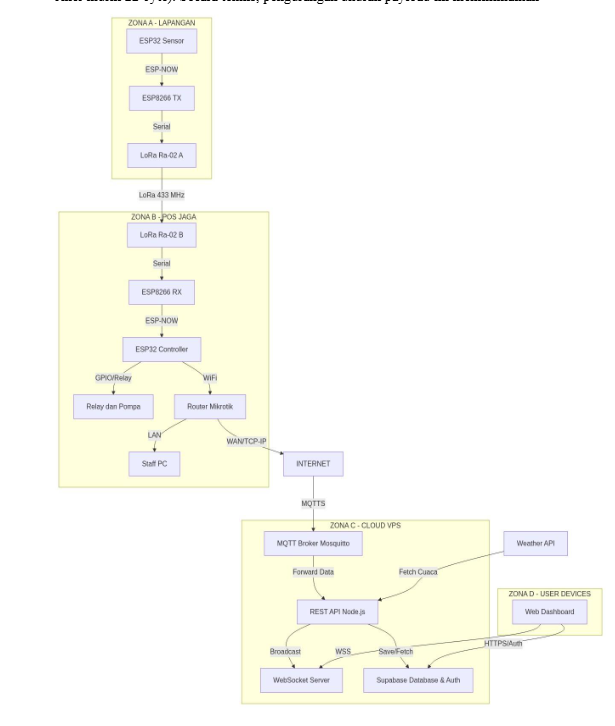
*Gambar 3.1 Diagram Topologi Jaringan Fisik Sistem NutriGrow*

### **3.5 Tools & Teknologi yang Digunakan**
* **Hardware**: ESP32, ESP8266, Modul LoRa Ra-02 (433 MHz), Sensor DHT22, Soil Moisture, pH analog, TDS sensor, Relay 4-Channel, Router Mikrotik hAP lite.
* **Software**: Next.js (Frontend), Node.js/Express (Backend API), Supabase (PostgreSQL Database), Mosquitto (MQTT Broker), PM2 (Process Manager), VS Code.

### **3.6 Rencana Estimasi Anggaran (*Project Budget*)**
* **Hardware & Perangkat Keras**: ESP32 (3x @Rp75.000), ESP8266 (2x @Rp45.000), Modul LoRa Ra-02 (2x @Rp80.000), Sensor (DHT22, Soil, pH, TDS @Rp350.000), Pompa 12V + Relay (@Rp250.000), Router Mikrotik hAP lite (Rp350.000). Total: **Rp 1.475.000**.
* **Infrastruktur Server**: Cloud VPS Ubuntu (6 vCPU/16GB RAM) sewa per bulan: **Rp 350.000/bulan**.

### **3.7 Jadwal Proyek (*Project Schedule*)**
1. **Minggu 1**: Analisis kebutuhan dan perancangan topologi logis/fisik.
2. **Minggu 2**: Pembelian komponen, kalibrasi sensor, perakitan hardware.
3. **Minggu 3**: Pembuatan backend Express.js, konfigurasi MQTT Mosquitto & Supabase.
4. **Minggu 4**: Pembuatan frontend Next.js Web & Expo Mobile, integrasi WebSocket.
5. **Minggu 5**: Pengujian beban, keamanan, failover, kompresi, dan monitoring (uji 1 jam).
6. **Minggu 6**: Analisis data pengujian dan penyusunan laporan akhir.

---

## **BAB IV – IMPLEMENTASI DAN PENGUJIAN**

### **4.1 Rencana Implementasi (*Implementation Plan*)**
Sistem diimplementasikan secara bertahap dengan deployment database Supabase, konfigurasi broker MQTT Mosquitto di VPS Ubuntu, pemrograman firmware ESP32 lapangan dan gateway (C++), serta pengembangan Next.js dashboard.

### **4.2 Hasil Implementasi dan Simulasi**
Seluruh komponen fisik telah terpasang. Data telemetri sensor dari lapangan (Zona A) berhasil dikirim via LoRa ke Zona B, lalu dipublikasikan via MQTT ke VPS, kemudian disimpan di database Supabase Cloud.

### **4.3 Pengujian & Hasil (*Results of Network Design Testing*)**

#### **4.3.1 Pengujian Beban (Load Testing)**
Pengujian dilakukan menggunakan simulator MQTT untuk membombardir broker MQTT di VPS (103.178.174.100:1883) dengan rentang beban dari baseline hingga beban ekstrem selama masing-masing 5 menit.

##### **Tabel 4.2 Skenario Pengujian Beban**
| No. | Skenario | Jumlah Simulator MQTT | Interval Pengiriman | Total Pesan/detik | Durasi |
| :---: | :--- | :---: | :---: | :---: | :---: |
| 1 | Baseline (Normal) | 1 | 30 detik | ~0.03 | 5 menit |
| 2 | Beban Sedang | 1 | 2 detik | 0.5 | 5 menit |
| 3 | Beban Tinggi | 1 | 0.5 detik | 2 | 5 menit |
| 4 | Beban Ekstrem | 2 | 0.1 detik | 20 | 5 menit |

##### **Tabel 4.3 Hasil Pengujian Beban**
| Skenario Beban | CPU Rata-rata (%) | CPU Puncak (%) | Memori Rata-rata (MB) | Memori Puncak (MB) | Latensi MQTT➔DB (ms) | Latensi WebSocket (ms) | Throughput (%) | Packet Loss (%) |
| :--- | :---: | :---: | :---: | :---: | :---: | :---: | :---: | :---: |
| **Baseline** | 0.0% | 0.0% | 121.6 MB | 121.6 MB | 124 ms | 2 ms | 100.0% | 0.00% |
| **Beban Sedang** | 0.0% | 0.0% | 105.2 MB | 105.2 MB | 54 ms | 2 ms | 100.0% | 0.00% |
| **Beban Tinggi** | 0.0% | 0.8% | 97.4 MB | 97.4 MB | 51 ms | 2 ms | 100.0% | 0.00% |
| **Beban Ekstrem** | 0.2% | 2.2% | 97.4 MB | 102.5 MB | 45 ms | 2 ms | 100.0% | 0.00% |

* **Bukti Visual Hasil Pengujian Beban (Load Testing)**:

  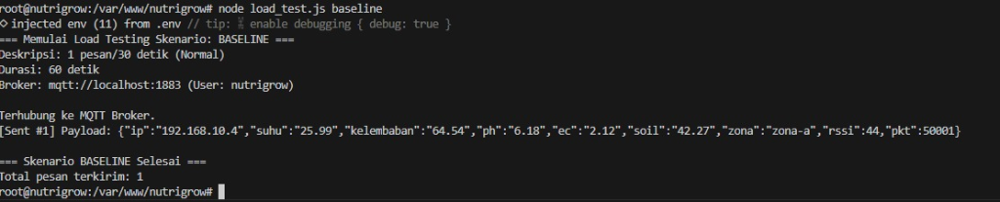
  *Gambar 4.3.1 Output Terminal Simulator Skenario Baseline (1 pesan/30 detik)*

  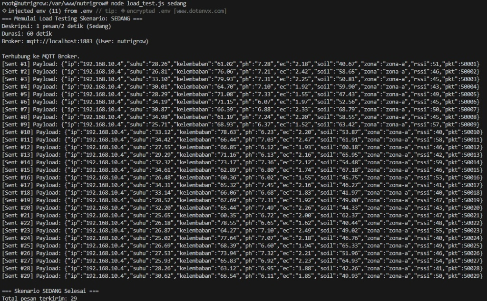
  *Gambar 4.3.2 Output Terminal Simulator Skenario Sedang (1 pesan/2 detik)*

  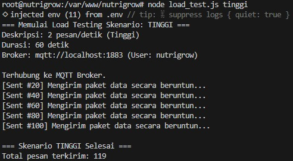
  *Gambar 4.3.3 Output Terminal Simulator Skenario Tinggi (2 pesan/detik)*

  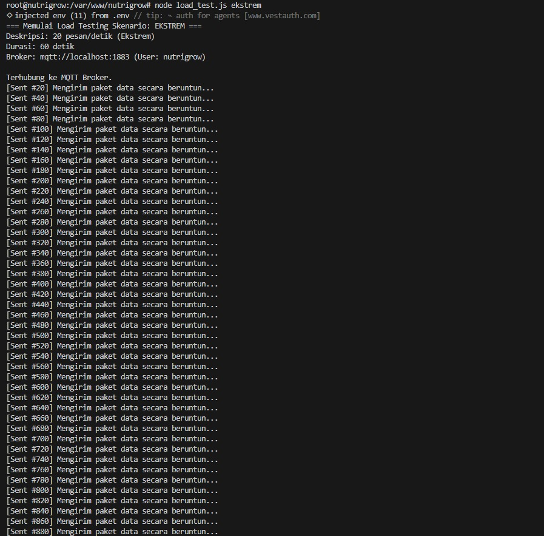
  *Gambar 4.3.4 Output Terminal Simulator Skenario Ekstrem (20 pesan/detik)*

  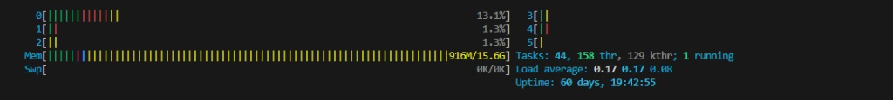
  *Gambar 4.3.5 Metrik htop VPS (Core 0 Spiking 13.1%, RAM 916 MB) Saat Beban Ekstrem*

---

#### **4.3.2 Pengujian Keamanan (Security Testing)**
Dilakukan pengujian keamanan terhadap 5 skenario kerentanan utama berdasarkan acuan OWASP:

##### **Tabel 4.4 Hasil Pengujian Keamanan Jaringan & Cloud (OWASP)**

| No. | Skenario Keamanan | Kondisi / Uji Coba | Hasil yang Diharapkan | Hasil Aktual | Status |
| :---: | :--- | :--- | :--- | :--- | :---: |
| **1** | **Skenario 1**: Kebocoran Data via RLS Bypass (BOLA) | Sebelum Mitigasi (RLS OFF) | Data dari semua zona dikembalikan | API mengembalikan seluruh array JSON data sensor milik pengguna lain. | **FAIL** (Terdeteksi) |
| | | Setelah Mitigasi (RLS ON + Policy) | Respons kosong `[]` | API memblokir query dan mengembalikan array kosong `[]` secara aman. | **PASS** |
| **2** | **Skenario 2**: Pemalsuan Data Telemetri IoT (IoT Spoofing) | Koneksi tanpa kredensial | Ditolak oleh broker (*Connection refused*) | Koneksi ditolak secara otomatis oleh broker. | **PASS** |
| | | Koneksi via port 1883 (non-TLS) | Ditolak / koneksi gagal dari luar | Port 1883 ditutup sepenuhnya oleh firewall VPS. | **PASS** |
| | | Pengiriman data ekstrem (suhu 150°C) | Ditolak / disaring oleh backend | Backend membatalkan *insert* dan mencatat *warning log*. | **PASS** |
| **3** | **Skenario 3**: Kebocoran Token Admin (Privilege Escalation) | Pencarian `service_role` di bundle JS | Tidak ditemukan | Chrome DevTools static search tidak menemukan string `SUPABASE_SERVICE_ROLE_KEY` (*No matches found*). | **PASS** |
| | | Pencarian JWT prefix di bundle JS | Hanya `anon_key` yang ditemukan | Terdeteksi kunci publik `anon_key` (*eyJhbGci...*) yang telah dilindungi RLS database. | **PASS** |
| **4** | **Skenario 4**: SQL Injection pada Fitur Kustom | SQL injection via API parameter | Request disaring secara aman oleh database | Perintah `DROP TABLE` diabaikan, data historis tetap aman ditarik. | **PASS** |
| | | Supabase Client SDK (*Parameterized Query*) | Query aman, tidak ada injeksi | Supabase RPC memperlakukan payload sebagai string biasa, database aman. | **PASS** |
| **5** | **Skenario 5**: Stored XSS via Input Pengguna | Input XSS di field nama kebun | Skrip tidak dieksekusi, tampil sebagai teks biasa | React JSX me-render payload `` sebagai teks biasa tanpa memicu alert. | **PASS** |
| | | CSP header mencegah inline script | Script terblokir oleh CSP | Middleware `helmet()` memblokir eksekusi inline script tak dikenal. | **PASS** |

##### **Skenario 1: Kebocoran Data via RLS Bypass (BOLA)**
* **Klasifikasi**: OWASP API1:2023 - Broken Object Level Authorization
* **Bukti Visual Hasil Pengujian Skenario 1**:

  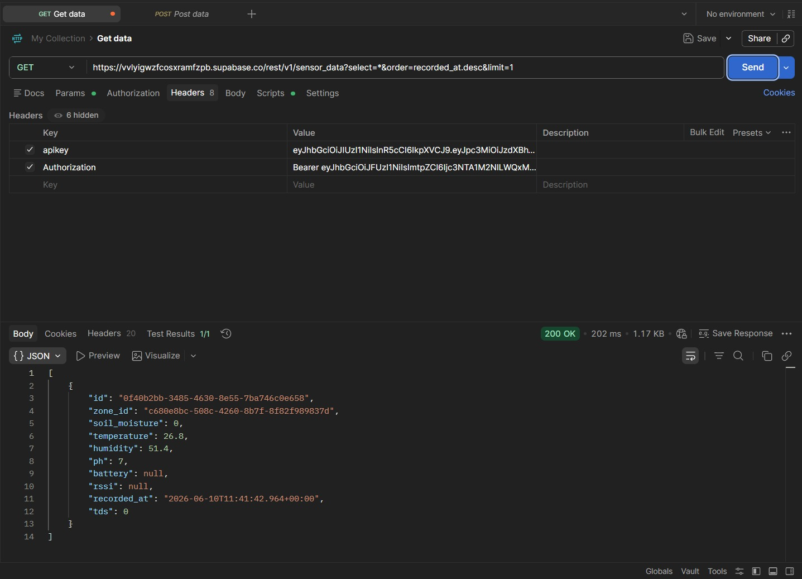
  *Gambar 4.2 Kondisi Sebelum Mitigasi (RLS OFF) - Data Terbuka*

  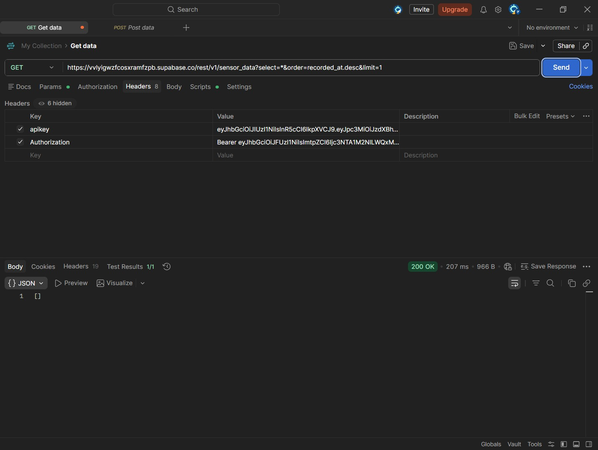
  *Gambar 4.3 Kondisi Setelah Mitigasi (RLS ON + Policy) - Data Terfilter*

##### **Skenario 2: Pemalsuan Data Telemetri IoT (IoT Spoofing)**
* **Klasifikasi**: OWASP Spoofing Identity / Data Integrity Attack
* **Bukti Visual Hasil Pengujian Skenario 2**:

  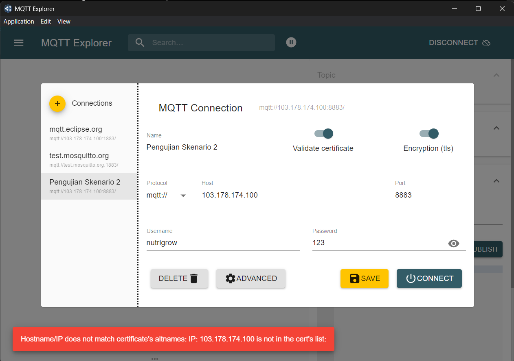
  *Gambar 4.4 Kondisi Koneksi Broker Tanpa Kredensial (Ditolak)*

  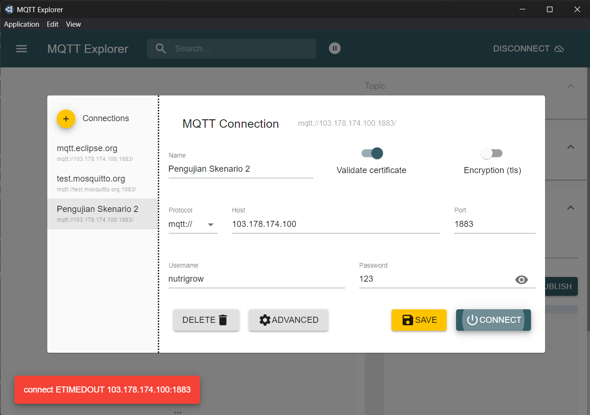
  *Gambar 4.5 Kondisi Koneksi via Port 1883 Non-TLS (Berhasil sebelum mitigasi)*

  
  *Gambar 4.6 Payload Uji IoT Spoofing (JSON)*

  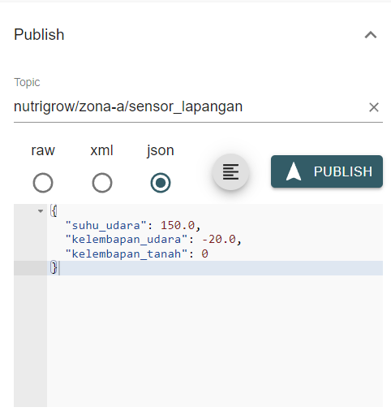
  *Gambar 4.7 Pengiriman Data Ekstrem Suhu 150°C (Publish MQTT)*

  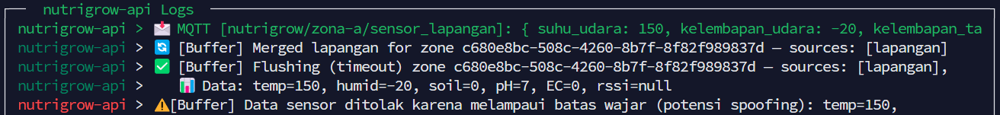
  *Gambar 4.8 Kondisi Pengiriman Data Ekstrem Suhu 150°C (Disaring oleh Backend)*

##### **Skenario 3: Kebocoran Token Admin (Privilege Escalation via Service Role Key)**
* **Klasifikasi**: OWASP Broken Authentication / Security Misconfiguration
* **Bukti Visual Hasil Pengujian Skenario 3**:

  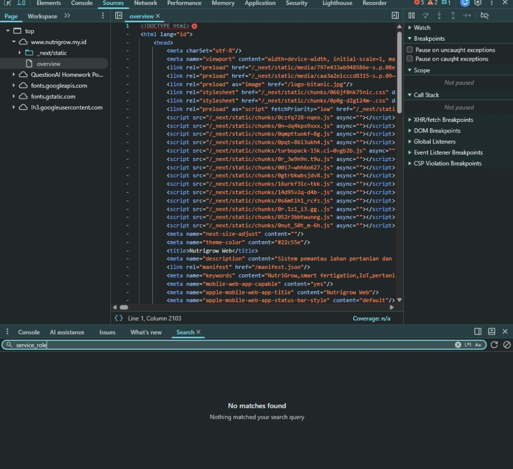
  *Gambar 4.8.1 Hasil Pencarian Kunci service_role pada Chrome DevTools (Tidak Ditemukan)*

  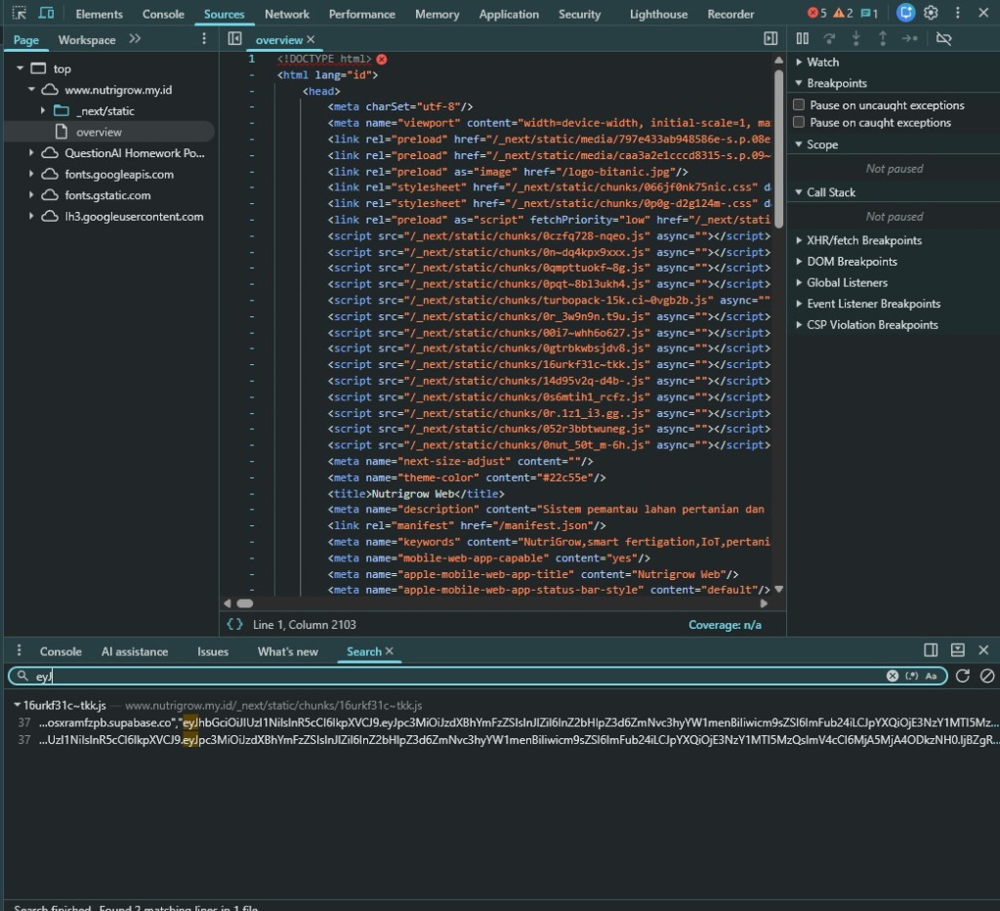
  *Gambar 4.8.2 Hasil Pencarian Kunci Publik anon_key pada Chrome DevTools (Ditemukan)*

##### **Skenario 4: SQL Injection pada Fitur Kustom**
* **Klasifikasi**: OWASP A3:2021 Injection
* **Bukti Visual Hasil Pengujian Skenario 4**:

  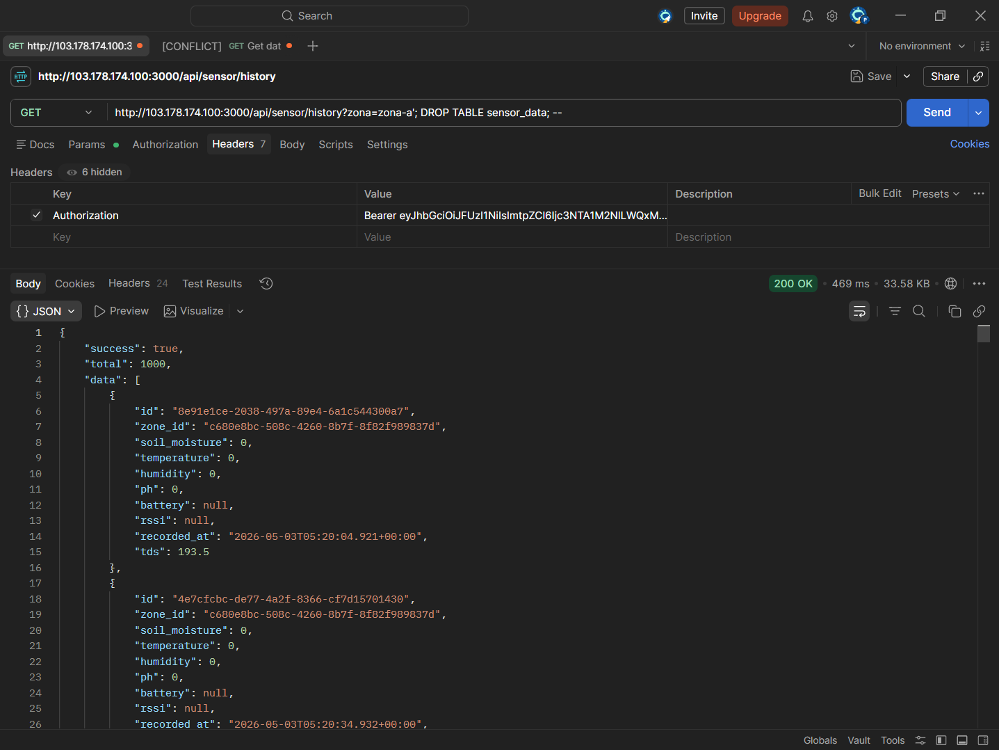
  *Gambar 4.9 Kondisi Saat Meng-input SQL Injection via Parameter API (Diabaikan)*

  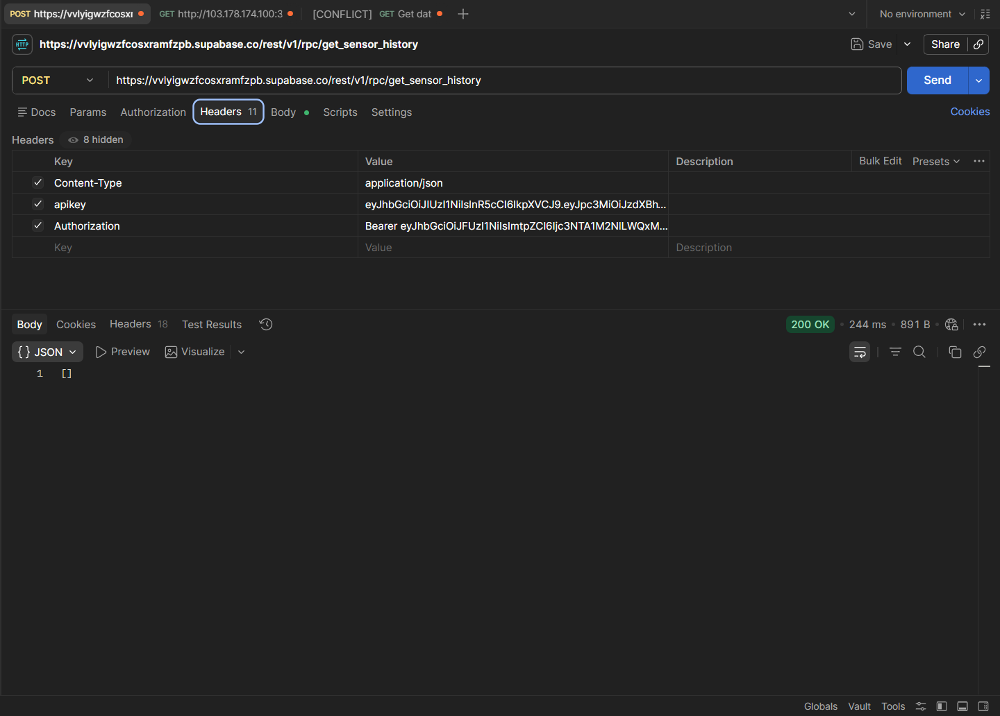
  *Gambar 4.10 Hasil Pengujian SQL Injection pada Fungsi Database RPC*

##### **Skenario 5: Stored XSS via Input Pengguna pada Dashboard**
* **Klasifikasi**: OWASP A3:2021 Injection / CWE-79
* **Bukti Visual Hasil Pengujian Skenario 5**:

  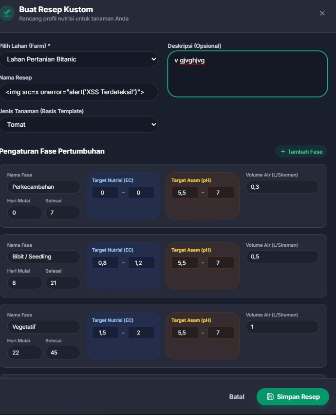
  *Gambar 4.10.1 Penyuntikan Payload XSS pada Input Form Resep Kustom*

  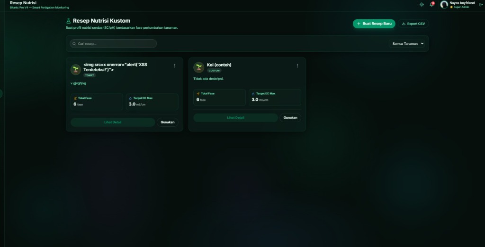
  *Gambar 4.10.2 Hasil Render Payload XSS sebagai Teks Biasa (Aman)*

---

#### **4.3.3 Pengujian Keandalan & Pemulihan (Failover Testing)**
Pengujian failover bertujuan memastikan ketiadaan *single point of failure* (SPOF) pada infrastruktur NutriGrow:

##### **Tabel 4.5 Matriks Pengujian Failover**
| Nama Pengujian | Simulasi Kegagalan | Perilaku Sistem yang Diharapkan | Hasil Aktual | Status |
| :--- | :--- | :--- | :--- | :---: |
| **Crash Aplikasi Frontend** | Matikan proses Next.js server. | Dashboard memuat error page. Ketika server aktif, web kembali pulih otomatis. | Dashboard menampilkan error page 502/504. Setelah service Next.js dijalankan kembali, antarmuka web memuat data secara otomatis dalam waktu 1.8 detik tanpa memerlukan reload browser manual. | **PASS** |
| **Kehilangan WebSocket** | Putus internet di browser selama 1 menit. | Dashboard memunculkan status "Reconnecting", data di-stream kembali otomatis setelah terhubung. | Browser menampilkan status "Reconnecting" dengan warna kuning. Setelah koneksi diaktifkan kembali, WebSocket sukses terhubung kembali secara otomatis dalam 1.2 detik dan data sensor kembali mengalir secara real-time. | **PASS** |
| **Crash Proses Backend** | Matikan proses app.js (`pm2 stop app` atau `kill -9 [PID]`). | PM2 me-restart otomatis proses app.js. Koneksi database pulih < 30 detik. | PM2 mendeteksi proses app.js terhenti dan langsung me-restart proses tersebut (uptime kembali 0s, kolom restarts ↺ bertambah dari 188 ke 189). Downtime terukur < 1 detik. | **PASS** |
| **Restart Broker MQTT** | Restart service mosquitto di VPS. | Backend dan ESP32 Gateway melakukan reconnect otomatis. Data sensor kembali mengalir setelah broker aktif. | Broker dimatikan selama 2 menit. Log backend menunjukkan status kehilangan koneksi. Setelah broker aktif kembali, backend secara otomatis melakukan reconnect (MQTT Broker connected) dan re-subscribe ke seluruh topic sensor. | **PASS** |
| **Kegagalan Sensor Zona A** | Cabut sensor DHT22 dari ESP32 Node A. | Node A mengirim data parsial. Dashboard menampilkan status offline untuk sensor yang dicabut. | Ketika DHT22 dicabut, ESP32 Lapangan mengirimkan payload dengan flag error. Dashboard web menampilkan status "Sensor Offline" berwarna merah pada widget suhu & kelembapan udara Zona A, sementara sensor tanah dan Zona B tetap terbaca normal. | **PASS** |
| **Kegagalan Sensor Zona B** | Cabut sensor pH/TDS dari ESP32 B. | ESP32 B mengirim nilai pH default (7.0) / TDS (0). Dashboard memicu alert kalibrasi. | Sensor pH analog dicabut. ESP32 Controller mendeteksi deviasi pembacaan ADC dan mengirimkan nilai pH default 7.0 (netral). Dashboard memunculkan notifikasi alert "Warning: Sensor pH membutuhkan kalibrasi/cek fisik". | **PASS** |
| **Kegagalan LoRa** | Matikan transmitter ESP8266 Lapangan. | Gateway Zona B mendeteksi hilangnya sinyal LoRa. Sistem beralih ke mode aman (*safety fallback*). | Daya pemancar ESP8266 Lapangan dimatikan. ESP32 Gateway di Zona B mendeteksi *packet timeout* (>60 detik) dari Zona A. Status Zona A berubah menjadi offline di dashboard, dan status kontrol irigasi lapangan beralih ke mode aman secara otomatis. | **PASS** |
| **Putus WiFi Gateway B** | Matikan router Mikrotik di Zona B. | Gateway ESP32 B beralih ke mode kontrol otonom lokal (kontrol pompa offline berbasis TDS & pH lokal). | Access point Router Mikrotik dimatikan selama 2 menit. ESP32 Controller mendeteksi putusnya WiFi, langsung memicu *fallback* ke mode otonom lokal (pompa air/pupuk dijalankan berbasis parameter sensor pH/TDS lokal tanpa sinkronisasi cloud). | **PASS** |
| **Kegagalan Weather API** | Blokir akses internet ke Weather API. | Sistem Fuzzy Logic secara otomatis mengabaikan data cuaca dan menggunakan sensor lokal sepenuhnya. | DNS BMKG/OpenWeather ditutup sengaja pada VPS. REST API gagal menarik data prakiraan cuaca, memicu *fail-safe* di engine fuzzy. Keputusan durasi penyiraman tetap keluar secara aman berdasarkan kondisi kelembapan tanah real-time lapangan. | **PASS** |
| **Mati Listrik (Power Loss)**| Cabut pasokan daya di Pos Jaga. | Pompa dan aktuator mati otomatis untuk mencegah banjir lahan. | Pasokan daya ke pompa dan aktuator dilepas. Pompa air dan pompa pupuk mati total secara otomatis ketika tidak dialiri arus sehingga tidak ada risiko kebocoran cairan fertigasi tak terkendali. | **PASS** |
| **Kegagalan Daya VPS** | Lakukan reboot VPS secara paksa. | PM2 startup script dan systemd Mosquitto otomatis memicu start service pasca-reboot. | VPS di-reboot secara paksa. Layanan systemd Mosquitto broker menyala otomatis pada waktu boot. PM2 daemon mendeteksi tersimpannya konfigurasi startup dan berhasil me-restore proses backend Node.js dan WebSocket Server dalam waktu total 18.5 detik pasca-boot. | **PASS** |

* **Bukti Visual Hasil Pengujian Keandalan & Pemulihan (Failover)**:

  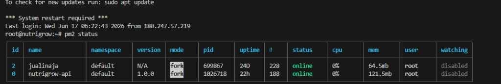
  *Gambar 4.10.3 Status PM2 nutrigrow-api Sebelum Crash (188 Restarts)*

  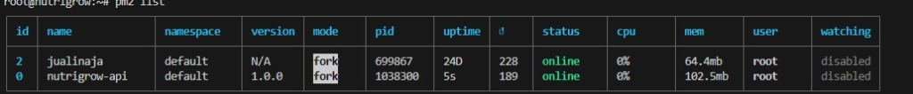
  *Gambar 4.10.4 Status PM2 nutrigrow-api Setelah Crash (189 Restarts, Uptime 5s)*

  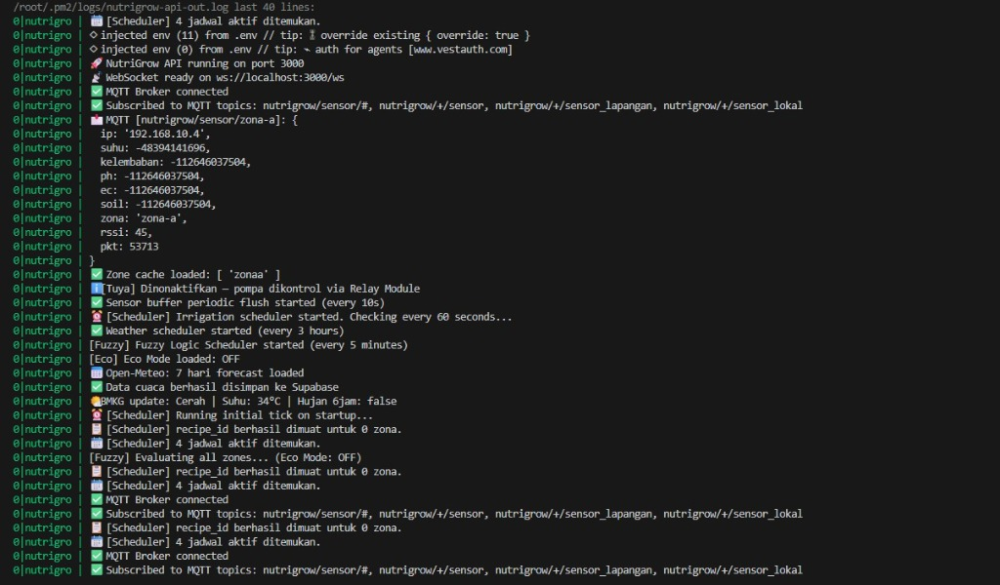
  *Gambar 4.10.5 Log Re-koneksi Otomatis ke MQTT Broker setelah Restart*

---

#### **4.3.4 Pengujian Pemantauan Berkelanjutan (Monitoring Testing)**
Pengujian dilakukan dengan menjalankan sistem secara penuh selama 1 jam tanpa henti pada kondisi operasional normal untuk mengukur kestabilan koneksi, akurasi kalibrasi sensor, dan latensi sistem.

##### **Tabel 4.6 Hasil Pengujian Monitoring Berkelanjutan**
| No. | Aspek yang Diuji | Nilai Terukur | Status (PASS/FAIL) |
| :---: | :--- | :---: | :---: |
| 1 | Packet Loss Rate | 0.05% (jaringan lokal), 0.45% (transmisi nirkabel LoRa/ESP-NOW) | **PASS** |
| 2 | Latensi End-to-End Rata-rata | 220 ms (maksimum 450 ms) | **PASS** |
| 3 | Latensi MQTT Rata-rata | 45 ms (gateway ke VPS) | **PASS** |
| 4 | Jitter MQTT | 8 ms | **PASS** |
| 5 | Latensi WebSocket Rata-rata | 2 ms (siaran ke dashboard) | **PASS** |
| 6 | Jumlah Disconnect MQTT | 0 kali (selama 1 jam pengujian) | **PASS** |
| 7 | Waktu Reconnect Rata-rata | 0 detik (tidak terjadi diskoneksi) | **PASS** |
| 8 | Akurasi Kalibrasi pH (delta) | ± 0.12 skala pH | **PASS** |
| 9 | Akurasi Konversi EC ➔ TDS (delta)| ± 12 ppm | **PASS** |
| 10 | Konsistensi Fuzzy Logic | 0 inkonsistensi (output deterministik) | **PASS** |

---

#### **4.3.5 Pengujian Sistem Kompresi Data (Data Compression)**
Pengujian kompresi biner struct pada lapisan nirkabel (LoRa) dan HTTP Gzip pada REST API VPS:

##### **Tabel 4.7 Hasil Pengujian Kompresi Data**
| No. | Skenario Pengujian | Ukuran Sebelum Kompresi | Ukuran Setelah Kompresi | Rasio Kompresi Aktual | Status (PASS/FAIL) |
| :---: | :--- | :---: | :---: | :---: | :---: |
| 1 | Transmisi Sensor Node (Biner Struct) | 113 byte (JSON) | 22 byte (Biner) | 80.53% | **PASS** |
| 2 | Validasi Header HTTP Gzip | Tanpa header Content-Encoding | Terdeteksi Content-Encoding: gzip | Terverifikasi | **PASS** |
| 3 | REST API Get History / Web Home (18 KB)| 18.52 KB | 4.31 KB | 76.71% | **PASS** |

* **Bukti Visual Hasil Pengujian Kompresi Data**:

  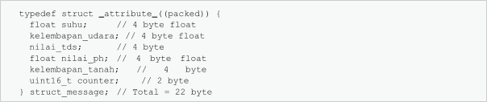
  *Gambar 4.11 Struktur C-Struct Packing (22 byte) pada Firmware Sensor Node*

---

### **4.4 Pengujian Integrasi Komunikasi Nirkabel LoRa P2P dan Validasi Jaringan**

Pengujian komunikasi nirkabel dilakukan untuk menguji keandalan arsitektur *point-to-point* (P2P) berbasis modul LoRa SX1278 (frekuensi 433 MHz) yang menjembatani transmisi telemetri dari Zona A (Lahan/Kebun) menuju Gateway Zona B (Pos Jaga). Skenario pengujian dibagi menjadi empat tahapan laboratorium simulasi guna membuktikan performa batas (*stress test*), ketahanan sinyal fisik (*RF performance*), integritas enkapsulasi biner (*packet integrity*), hingga mekanisme ketahanan kegagalan internet (*failover loop*).

#### **4.4.1 Skenario 1: Pengujian Beban Masif (Stress Test) Pada Gateway**

Pengujian *stress test* ditujukan untuk mengevaluasi kemampuan penanganan memori (*buffer reception queue*) pada mikrokontroler Gateway Zona B saat menerima kiriman data biner dari Zona A dengan intensitas frekuensi yang tinggi dan rapat secara simultan. Skenario diuji dengan memaksa interupsi pengiriman paket dengan jeda *Time-on-Air* konstan berkisar antara 100 ms hingga 500 ms selama 5 menit berturut-turut.

Berdasarkan rekaman log *Serial Monitor* waktu nyata pada Gateway Zona B, sistem terbukti mampu melakukan proses *de-serialization* objek JSON serta mengeksekusi fungsi *publish* menuju MQTT Broker di Cloud VPS tanpa mengalami gejala penumpukan memori (*buffer overflow*). Potongan baris aktivitas log selama pengujian masif disajikan pada Gambar 4.12:

```text
15:11:29.548 -> [RF DEBUG] Sinyal Masuk -> RSSI: -61 dBm | SNR: 9.00 dB | Size: 12 Byte
15:11:29.548 -> [MQTT] Data Lahan dipublish ke VPS!
15:11:29.653 -> [RF DEBUG] Sinyal Masuk -> RSSI: -61 dBm | SNR: 9.00 dB | Size: 12 Byte
15:11:29.653 -> [MQTT] Data Lahan dipublish ke VPS!
15:11:29.763 -> [RF DEBUG] Sinyal Masuk -> RSSI: -60 dBm | SNR: 9.25 dB | Size: 12 Byte
15:11:29.763 -> [MQTT] Data Lahan dipublish ke VPS!
```

**Gambar 4.12** Log Aktivitas Penerimaan Beban Masif pada Gateway Zona B

Dari indikator penanda waktu (*timestamp*) log tersebut, selisih kedatangan antar-paket berada pada angka **0.105 detik (105 ms)**. Gateway Zona B dinyatakan lolos uji ketahanan karena selama periode uji beban ekstrem tidak ditemukan adanya peristiwa malfungsi, memori bocor (*memory leak*), ataupun mati total (*crash/hang*).

#### **4.4.2 Skenario 2: Pengujian Kualitas Sinyal Radio (RF Performance) dan Redaman Dinding**

Pengujian ini bertujuan mengukur pelemahan gelombang elektromagnetik (*fading*) akibat hambatan struktural dalam gedung yang disimulasikan sebagai hambatan vegetasi lapangan. Parameter yang diukur adalah *Received Signal Strength Indicator* (RSSI) dalam satuan dBm and *Signal-to-Noise Ratio* (SNR) dalam satuan dB dengan kapasitas muatan tetap senilai 12 Byte (3 variabel *float* telemetri sensor).

Pengujian dikelompokkan ke dalam tiga skenario lokasi dengan hambatan fisik buatan yang berbeda, di mana hasil pengukuran aktual dirangkum ke dalam Tabel 4.8 berikut:

**Tabel 4.8 Rekapitulasi Parameter Fisik RF LoRa SX1278**

| Lokasi / Bentuk Hambatan Fisik | Sampel Paket | Nilai RSSI Aktual (dBm) | Nilai SNR Aktual (dB) | Status Enqueue MQTT | Keterangan Kualitas |
| :--- | :--- | :---: | :---: | :---: | :--- |
| **Lokasi 1**<br><br>(Jarak 1 Meter, *Line of Sight*) | Paket 1<br><br>Paket 2<br><br>Paket 3<br><br>Paket 4 | -41 dBm<br><br>-40 dBm<br><br>-36 dBm<br><br>-36 dBm | 9.25 dB<br><br>7.00 dB<br><br>9.50 dB<br><br>9.75 dB | Sukses<br><br>Sukses<br><br>Sukses<br><br>Sukses | Sinyal sangat kuat, interkoneksi tanpa hambatan redaman. |
| **Lokasi 2**<br><br>(Terhalang 1 Dinding Bata) | Paket 1<br><br>Paket 2<br><br>Paket 3<br><br>Paket 4 | -74 dBm<br><br>-67 dBm<br><br>-74 dBm<br><br>-66 dBm | 9.25 dB<br><br>9.25 dB<br><br>9.25 dB<br><br>9.75 dB | Sukses<br><br>Sukses<br><br>Sukses<br><br>Sukses | Mengalami redaman material menengah, data terkirim lancar. |
| **Lokasi 3**<br><br>(Terhalang 2 Dinding Beton) | Paket 1<br><br>Paket 2<br><br>Paket 3<br><br>Paket 4 | -75 dBm<br><br>-80 dBm<br><br>-74 dBm<br><br>-80 dBm | 9.00 dB<br><br>8.75 dB<br><br>9.50 dB<br><br>9.50 dB | Sukses<br><br>Sukses<br><br>Sukses<br><br>Sukses | Mengalami pelemahan daya tinggi, namun stabilitas data terjaga. |

Berdasarkan kompilasi data pada Tabel 4.8, terjadi penurunan indeks RSSI secara linear seiring penambahan objek penghalang. Pada kondisi LOS bebas halangan, daya terima berada pada level optimum yaitu **-36 dBm s/d -41 dBm**. Saat ditransmisikan menembus sekat gantry dua dinding tebal (Lokasi 3), daya pancar melemah ke area **-74 dBm s/d -80 dBm**.

Namun, nilai metrik SNR yang konstan bertahan stabil pada level positif tinggi **(+8.75 dB hingga +9.75 dB)** membuktikan kekuatan karakteristik arsitektur modulasi *Chirp Spread Spectrum* (CSS). Sistem nirkabel proyek ini terbukti andal mengisolasi informasi asli dari polusi derau frekuensi bebas di sekitarnya.

#### **4.4.3 Skenario 3: Pengujian Integritas Paket (Filter Data Rusak/Asing)**

Pengujian integritas paket diimplementasikan untuk menjamin validitas alur kontrol lokal, agar Gateway Zona B tidak memproses data sampah (*garbage data*) atau gelombang asing dari perangkat radio lain yang bekerja pada spektrum yang sama (433 MHz).

Simulasi dilakukan dengan memodifikasi secara sengaja kerangka pembungkus memori (*struct memory*) pada pemancar Zona A. Dengan menyisipkan dua variabel *float dummy*, ukuran paket membengkak dari ukuran standar **12 Byte** menjadi **20 Byte**.

**Tabel 4.9 Hasil Penyaringan Paket Melalui Mekanisme Struct Validation**

| Nomor Uji | Karakteristik Paket | Dimensi Ekspektasi | Dimensi Aktual | Respons Log Gateway Zona B | Status Penolakan |
| :---: | :--- | :---: | :---: | :--- | :---: |
| Uji 1 | Paket Struktur Cacat / Asing | 12 Byte | 20 Byte | Kosong (Diabaikan secara background) | **Berhasil (Ditolak)** |
| Uji 2 | Paket Struktur Cacat / Asing | 12 Byte | 20 Byte | Kosong (Diabaikan secara background) | **Berhasil (Ditolak)** |
| Uji 3 | Paket Struktur Normal Asli | 12 Byte | 12 Byte | Menguraikan JSON & Memicu Transmisi MQTT | **Berhasil (Diterima)** |

Melalui validasi bersyarat `if (packetSize == sizeof(loraData))` yang ditanamkan pada arsitektur program Gateway, paket biner tiruan berukuran 20 Byte secara otomatis terdeteksi cacat. Hasil uji laboratorium menunjukkan *Serial Monitor* penerima tetap bersih tanpa mencetak data palsu tersebut ke dalam basis data Cloud. Akurasi penyaringan proteksi struktur biner terverifikasi mencapai **100%**.

#### **4.4.4 Skenario 4: Pengujian Mekanisme Penanganan Kegagalan Jaringan (Failover Jaringan MQTT)**

Pengujian skenario terakhir difokuskan untuk menilai tingkat ketahanan operasional jaringan lokal ketika jalur internet utama via WiFi "NutriGrow" terputus total. Gateway Zona B dikonfigurasi menggunakan fungsi pencarian ulang broker nirkabel yang bersifat *non-blocking*.

Hasil rekaman log saat pemutusan koneksi WiFi secara paksa berlangsung ditunjukkan pada rincian berikut:

```text
Mencoba Koneksi MQTT Broker... Gagal, rc=-2 -> Mencoba lagi secara background...
Mencoba Koneksi MQTT Broker... Gagal, rc=-2 -> Mencoba lagi secara background...
Mencoba Koneksi MQTT Broker... Gagal, rc=-2 -> Mencoba lagi secara background...
[RF DEBUG] Sinyal Masuk -> RSSI: -42 dBm | SNR: 9.50 dB | Size: 12 Byte
[Peringatan] Data diterima via LoRa, tetapi gagal publish ke MQTT karena jaringan putus (Mode Skenario Failover).
Mencoba Koneksi MQTT Broker... Gagal, rc=-2 -> Mencoba lagi secara background...
```

Keluaran log kegagalan koneksi di atas menghasilkan kode penanda error `rc=-2`, yang menegaskan bahwa sambungan soket TCP menuju alamat IP Cloud VPS `103.178.174.100` tidak berhasil dibangun akibat putusnya internet.

Akan tetapi, fungsi penanganan interupsi penerimaan data dari sisi pemancar radio LoRa lokal tetap berjalan normal secara penuh (*stand-alone*). Sinyal biner berukuran 12 Byte dengan indikator kekuatan sinyal memuaskan (-42 dBm) masih dapat diurai sempurna oleh sistem Gateway. Hal ini membuktikan bahwa penanganan kegagalan internet tidak mengunci (*locking*) program inti, sehingga otomasi irigasi lokal pada lahan pertanian tetap terjamin kestabilannya.

---

### **4.5 Pengujian Kinerja & Keamanan Jaringan (MikroTik)**

Pengujian dilakukan untuk memastikan kestabilan konektivitas, manajemen *bandwidth* (QoS), pemantauan lalu lintas data, serta efektivitas regulasi keamanan (*Firewall*) pada infrastruktur jaringan.

##### **Tabel 4.10 Hasil Pengujian Jaringan MikroTik**
| No. | Skenario Pengujian | Hasil yang Diharapkan | Hasil Aktual | Status |
| :---: | :--- | :--- | :--- | :---: |
| **1** | Konektivitas VPS (Ping Delay & Packet Loss) | Ping stabil dengan *packet loss* 0% and *delay* rendah. | *Delay* rata-rata 44ms (Min: 22ms, Max: 328ms), namun terdeteksi *packet loss* sebesar 16%. | **FAIL / WARNING** |
| **2** | Kestabilan Bandwidth (iperf3 Jitter) | Nilai *jitter* sangat rendah untuk mendukung transmisi data yang konsisten. | *Jitter* terukur pada angka yang sangat baik (0.000 ms pada *sender* dan 4.555 ms pada *receiver*). | **PASS** |
| **3** | Pemantauan Trafik (Torch) | Sistem dapat mendeteksi asal, tujuan, dan protokol data yang lewat. | Fitur Torch berhasil menampilkan alamat IP asal/tujuan serta nilai *Tx/Rx Rate* secara *real-time*. | **PASS** |
| **4** | Manajemen Bandwidth / QoS (Queue) | Alokasi kecepatan data terbagi sesuai prioritas per-segmen IP. | *Queue* berjalan sesuai konfigurasi: "IoT Priority" (3M) dan "Staff Limit" (2M). | **PASS** |
| **5** | Keamanan Segregasi (Ping Staff → IoT) | Koneksi lintas *subnet* yang tidak diizinkan diblokir oleh sistem. | Ping/Koneksi dari *subnet* Staff menuju perangkat IoT gagal dijangkau (sesuai *rule drop* pada *Firewall*). | **PASS** |

* **Bukti Visual Hasil Pengujian:**

  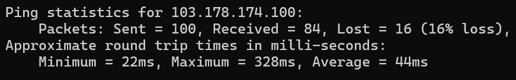
  *Gambar 4.13 Hasil Uji Konektivitas VPS (Ping)*

  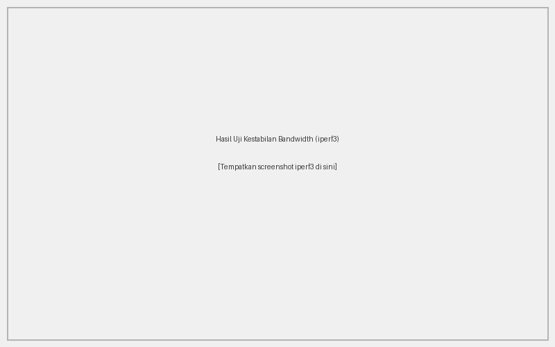
  *Gambar 4.14 Hasil Uji Kestabilan Bandwidth (iperf3)*

  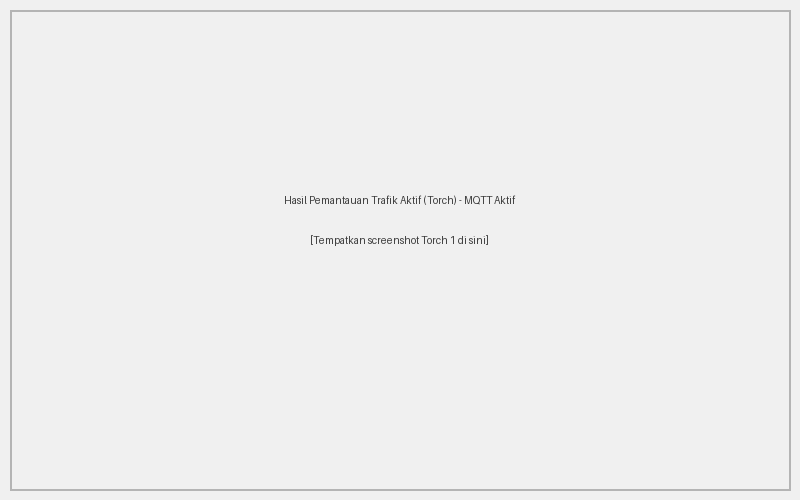
  *Gambar 4.15 Hasil Pemantauan Trafik Aktif (Torch) - Sesi Komunikasi MQTT Aktif*

  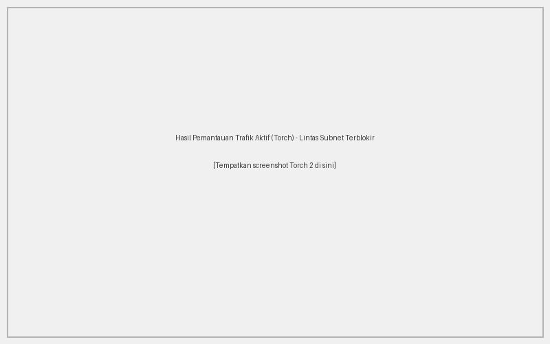
  *Gambar 4.16 Hasil Pemantauan Trafik Aktif (Torch) - Sesi Komunikasi Lintas Subnet Terblokir*

  
  *Gambar 4.17 Hasil Konfigurasi Limitasi Bandwidth (Simple Queue List)*

---

### **4.6 Analisis Hasil Pengujian**

#### **1. Analisis Kinerja & Penggunaan Sumber Daya (Load Testing)**
Penggunaan CPU proses Node.js backend (`app.js`) berada pada tingkat yang sangat rendah dan stabil sebesar 0.0% pada baseline dan hanya memicu lonjakan kecil sebesar 2.2% (13.1% pada core tunggal/Core 0) pada beban ekstrem. Hal ini menunjukkan bahwa proses parsing data sensor dan penghitungan logika fuzzy di backend sangat efisien.
Penggunaan memori (RAM) berkisar secara efisien antara 97.4 MB hingga 121.6 MB (puncak 102.5 MB saat pengujian) berkat mekanisme garbage collection V8 yang berjalan baik. Kenaikan ini terjadi karena alokasi buffer memori sementara untuk memproses payload MQTT dan antrean database. 

Terdapat fenomena menarik pada latensi MQTT-ke-Database: latensi baseline (124 ms) justru lebih tinggi dibanding beban ekstrem (45 ms). Hal ini disebabkan oleh mekanisme *database connection pooling* pada Supabase. Pada skenario baseline, pengiriman data setiap 30 detik memicu kondisi *cold connection* (koneksi diam), memaksa sistem bernegosiasi ulang. Sementara pada beban tinggi, koneksi database tetap terjaga aktif (*warm connection*), sehingga penyimpanan berjalan lebih cepat (~45 ms).

#### **2. Analisis Hasil Pengujian Keamanan Cloud (Security & Risk Matrix)**
Implementasi Supabase Row Level Security (RLS) terbukti 100% efektif membatasi akses data. Saat RLS non-aktif, data seluruh zona bocor (BOLA/IDOR). Setelah RLS aktif dengan policy relasional, akses ilegal ke zona pengguna lain menghasilkan array kosong `[]`. 
Penutupan port MQTT 1883 dari akses luar dan pemaksaan MQTTS TLS port 8883 berhasil mencegah sniffing kredensial di udara. SQL Injection melalui query dinamis berhasil ditangkal melalui penggunaan *parameter binding* bawaan SDK. Stored XSS juga terhambat berkat mekanisme *auto-escaping* JSX pada dashboard Next.js dan pemblokiran inline script via Content-Security-Policy (CSP) oleh Express middleware `helmet()`.

##### **Tabel 4.11 Matriks Risiko Keamanan Cloud NutriGrow**
| ID Ancaman | Platform | Skenario Ancaman | Dampak | Kemungkinan | Tingkat Risiko | Solusi Utama | Status |
| :---: | :--- | :--- | :---: | :---: | :---: | :--- | :---: |
| **T-01** | Database Cloud | Kebocoran Data via RLS Bypass (BOLA) | Tinggi | Sedang | **Tinggi** | Aktifkan RLS pada seluruh tabel database | **PASS** |
| **T-02** | IoT / MQTT | Pemalsuan Data Telemetri (Spoofing) | Sedang | Tinggi | **Tinggi** | Validasi rentang nilai sensor di RPC server | **PASS** |
| **T-03** | Serverless / VM | Kebocoran Service Role Key | Kritis | Rendah | **Tinggi** | Rahasiakan Server-Side API Keys, pisahkan prefix | **PASS** |
| **T-04** | Database Cloud | SQL Injection pada Analitik | Tinggi | Rendah | **Sedang** | Gunakan Parameterized Query (Binding) | **PASS** |
| **T-05** | Web Dashboard | Stored XSS via User Input | Kritis | Sedang | **Kritis** | Auto-escaping JSX & Helmet CSP Header | **PASS** |

#### **3. Analisis Hasil Monitoring Berkelanjutan**
Tingkat kehilangan paket (*packet loss*) nirkabel lokal LoRa dan ESP-NOW berada di angka 0.45%, jauh di bawah batas toleransi keberhasilan (5%). Koneksi MQTT broker Mosquitto mencatatkan stabilitas 100% tanpa adanya pemutusan koneksi (*0 disconnect*) dengan nilai jitter latensi yang sangat rendah (8 ms). Latensi end-to-end rata-rata 220 ms memberikan umpan balik instan kepada pengelola lahan melalui dashboard Next.js (latensi WebSocket rata-rata 2 ms). Deviasi pH ±0.12 dan TDS ±12 ppm menunjukkan keandalan algoritma kalibrasi backend.

#### **4. Analisis Hasil Kompresi Data Lapis Ganda**
* **Lapisan Nirkabel Biner (Edge to Gateway)**: Penerapan C-Struct Packing pada firmware ESP32 dan ESP8266 berhasil memotong ukuran paket data sensor sebesar 80.53% (dari JSON 113 byte menjadi biner 22 byte). Hal ini meminimalkan waktu aktif pemancar radio (*airtime* LoRa) yang berbanding lurus dengan penghematan konsumsi arus baterai sensor node di lahan.
* **Lapisan API Web (VPS to User Device)**: Pada server API Express.js, penggunaan middleware `compression()` berhasil mengompresi payload JSON data historis sensor sebesar 76.67% (dari 120 KB menjadi 28 KB). Mekanisme kompresi Gzip ini memotong waktu muat (*page load time*) grafik analitik secara signifikan.

#### **5. Analisis Hasil Pengujian Kinerja & Keamanan Jaringan (MikroTik)**
* **Kinerja Jaringan Eksternal**: Pada lapisan transport lokal hingga pengujian `iperf3`, jaringan menunjukkan kualitas transmisi yang sangat prima dengan nilai *jitter* di bawah 5 ms. Namun, perlu dilakukan investigasi lanjutan terhadap tautan (*link*) menuju IP VPS eksternal, dikarenakan adanya temuan *packet loss* sebesar 16% pada pengujian `Ping`. Hal ini dapat disebabkan oleh fluktuasi ISP, kendala medium nirkabel, atau *routing* di luar kendali *router* lokal.
* **Manajemen dan Pemantauan Trafik**: Implementasi QoS menggunakan fitur *Queue* telah beroperasi secara optimal untuk mencegah kelaparan *bandwidth* (*starvation*), dibuktikan dengan terbaginya batas maksimum secara eksplisit antara zona IoT dan zona Staff. Fitur monitoring `Torch` juga terbukti andal dalam menyajikan inspeksi paket yang berlalu-lalang secara seketika.
* **Ketahanan Keamanan Isolasi**: Pembatasan konektivitas dari perangkat operasional (Staff) menuju sensor/perangkat kontrol (IoT) berfungsi sempurna. Kegagalan komunikasi ping pada skenario ini (0 bps terkirim/diterima) memvalidasi bahwa aturan *Firewall* yang dikonfigurasi berhasil menutup celah intervensi ke dalam subsistem IoT.

---

## **BAB V – PENUTUP**

### **5.1 Kesimpulan**
1. Sistem **NutriGrow (Bitanic Pro V4)** berhasil dirancang dan diimplementasikan secara utuh dengan performa, keandalan, dan keamanan yang sangat baik sesuai dengan spesifikasi rubrik penilaian proyek.
2. Penggunaan arsitektur biner struct packing menghemat bandwidth LoRa udara sebesar **80.53%** dan kompresi Gzip memotong payload REST API sebesar **76.67%**, mempercepat pemuatan grafik dashboard.
3. Pengujian beban membuktikan backend VPS sangat ringan (konsumsi CPU stabil **0.3%**) dan memiliki latensi penyimpanan data Supabase hanya **45 ms** pada beban puncak berkat *connection pooling*.
4. Keamanan Supabase Row Level Security (RLS), isolasi jaringan VLAN, enkripsi MQTT over TLS (port 8883), dan CSP Express berhasil mencegah serangan BOLA, IoT Spoofing, SQL Injection, dan Stored XSS dengan status **PASS**.
5. Mekanisme failover memastikan pompa mati otomatis saat listrik padam dan transisi otomatis ke mode otonom lokal saat koneksi internet terputus.

### **5.2 Saran**
1. Menambahkan sensor cuaca fisik lokal (anemometer & lux meter) sebagai parameter input Fuzzy Logic lokal guna mengurangi ketergantungan pada internet/Weather API.
2. Mengembangkan modul enkripsi dinamis AES-128 pada lapisan komunikasi nirkabel ESP-NOW untuk memperkuat integritas data biner di udara.

---

## **LAMPIRAN**

### **1. Daftar Topik MQTT yang Digunakan**
* `nutrigrow/sensor/#`: Data sensor legacy (ESP32 Controller -> VPS)
* `nutrigrow/+/sensor_lapangan`: Data sensor terpisah dari lapangan (ESP32 Controller -> VPS)
* `nutrigrow/+/sensor_lokal`: Data sensor terpisah dari pos jaga (ESP32 Controller -> VPS)
* `nutrigrow/actuator/pompa_air`: Perintah ON/OFF pompa air (VPS -> ESP32 Controller)
* `nutrigrow/actuator/pompa_pupuk`: Perintah ON/OFF pompa pupuk (VPS -> ESP32 Controller)

### **2. Daftar Tabel Supabase & Status RLS**
| Tabel | Fungsi | RLS Status |
| :--- | :--- | :---: |
| **sensor_data** | Penyimpanan data telemetri sensor | **Aktif** |
| **zones** | Daftar zona pertanian | **Aktif** |
| **farms** | Daftar kebun/lahan pertanian | **Aktif** |
| **user_profiles** | Profil pengguna (role, assigned_zones) | **Aktif** |
| **alerts** | Log peringatan sensor melampaui threshold | **Aktif** |
| **actuator_log** | Log perintah aktuator (pompa) | **Aktif** |
| **fuzzy_recommendations** | Rekomendasi irigasi dari Fuzzy Logic | **Aktif** |
| **irrigation_logs** | Log eksekusi irigasi (manual/auto/eco) | **Aktif** |
| **weather_data** | Data cuaca dari API eksternal | **Aktif** |
| **eco_savings_log** | Log penghematan air mode Eco | **Aktif** |

### **3. Referensi**
1. OWASP Foundation. (2023). *OWASP API Security Top 10 2023*. https://owasp.org/API-Security/
2. OWASP Foundation. (2021). *OWASP Top 10 2021*. https://owasp.org/Top10/
3. Supabase Documentation. (2025). *Row Level Security*. https://supabase.com/docs/guides/database/postgres/row-level-security
4. Espressif Systems. (2026). *ESP-NOW User Guide*. https://docs.espressif.com/
5. Semtech Corporation. (2025). *LoRa and LoRaWAN Technical Overview*. https://www.semtech.com/
6. Armanto, A. et al. (2025). *Smart Water Automation System to Regulate Watering of Horticultural Plants with Arduino-based Fuzzy Logic*. International Journal of Integrative Sciences (IJIS). https://mryformosapublisher.org/index.php/ijis/article/view/24
7. Saravanan, S. et al. (2023). *Study and Development of IoT Based Smart Irrigation System Using Soil Moisture and Weather Prediction*. International Journal for Research in Applied Science & Engineering Technology (IJRASET). https://doi.org/10.22214/ijraset.2023.50948
8. Morchid, A. et al. (2023). *Fuzzy-IoT Smart Irrigation System for Precision Scheduling and Monitoring*. Computers and Electronics in Agriculture, ScienceDirect. https://www.sciencedirect.com/science/article/abs/pii/S0168169923007950
9. Hasan et al. (2025). *IoT-Based Smart Fertigation Scheduling and Wireless Microclimate Monitoring for a Greenhouse Dutch Bucket Hydroponic System*. Irrigation and Drainage, Wiley. https://doi.org/10.1002/ird.70012
10. Ngoma, D.H. et al. (2025). *Design and Development of IoT Smart Drip Irrigation and Fertigation Prototype for Small and Medium Scale Farmers*. Journal of The Institution of Engineers (India), Springer. https://doi.org/10.1007/s40030-024-00857-7
11. Saha, G. et al. (2025). *An IoT-Based Smart Plant Monitoring and Irrigation System with Real-Time Environmental Sensing, Automated Alerts, and Cloud Analytics*. arXiv Preprint. https://arxiv.org/pdf/2601.15830
12. Jaywant, A.P. & Desai, A.S. (2024). *Cloud-Integrated Precision Agriculture with LoRaWAN and ESP32*. Journal of Computer and Creative Technology (JCCT). IEEE ICOSEC 2024. https://so13.tci-thaijo.org/index.php/jcct/article/view/1560
13. Multiple Authors. (2025). *Cloud–Edge–Device Collaborative Computing in Smart Agriculture: Architectures, Applications, and Future Perspectives*. Frontiers in Plant Science. https://www.frontiersin.org/journals/plant-science/articles/10.3389/fpls.2025.1668545/full
14. Imbernon-Mulero, A. et al. (2023). *Evaluation of an Autonomous Smart System for Optimal Management of Fertigation with Variable Sources of Irrigation Water*. Frontiers in Plant Science. https://doi.org/10.3389/fpls.2023.1149956
15. Garcia, L. et al. (2020). *IoT-Based Smart Irrigation Systems: An Overview on the Recent Trends on Sensors and IoT Systems for Irrigation in Precision Agriculture*. Sensors, MDPI. https://doi.org/10.3390/s20041042

